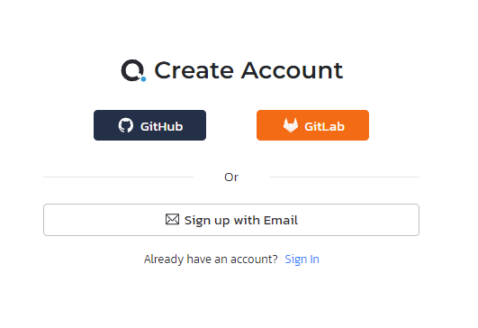
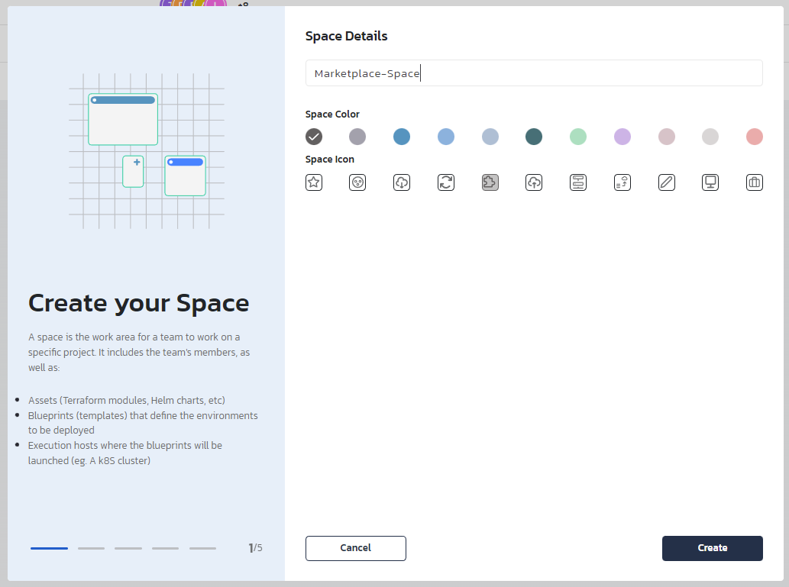
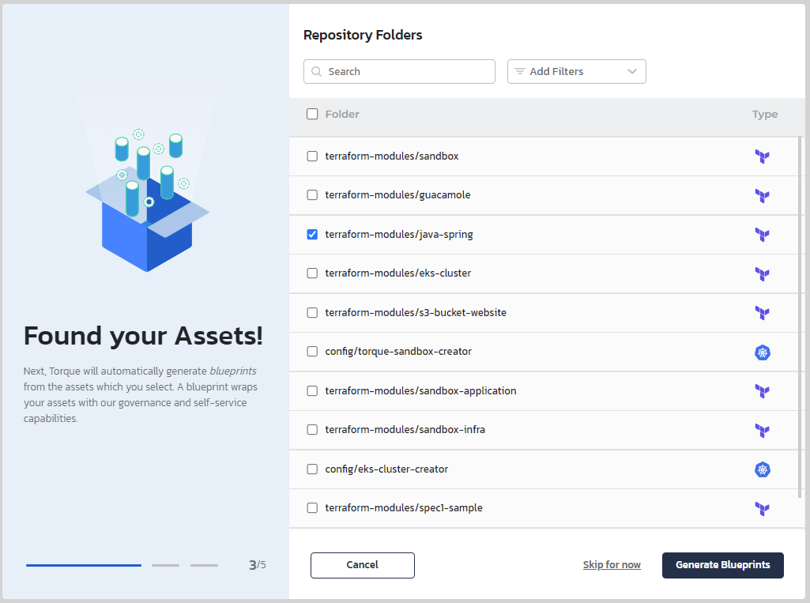
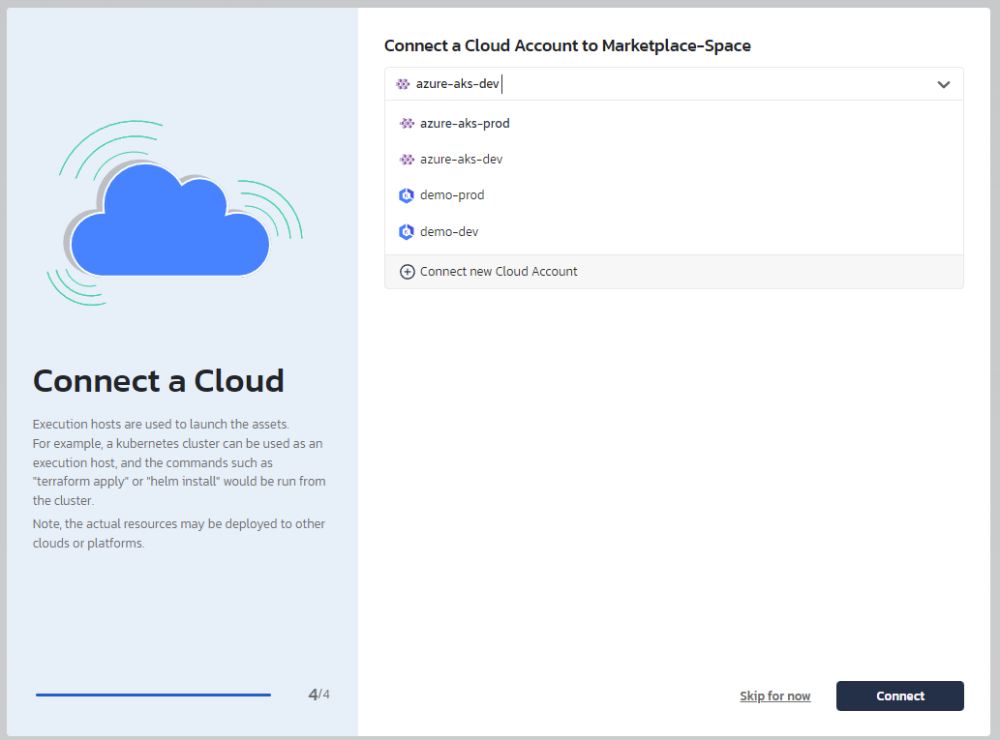

# Torque Building-blocks Marketplace

Welcome to the Toruqe's marketplace - The place to find, learn more and share IaC modules, container orchestration assets and Torque bluerpints for easy onboarding to Torque or adding .

### Already have a Torque account? Jump to step X

## Step 1: Open Torque Portal
* On the [Quali Torque page](https://www.qtorque.io/), click on "GET STARTED" button.

## Step 2: Register to Torque
* Registration to Torque can be done using email, GitHub or Gitlab accounts. Already have an account? Just sign in.

## Step 3: Create a new space and onboard the marketpalce repository as an asset repository
* Navigate to the "Admin Console" --> "Spaces"
* Click on "Create Space" 
* Creating a new space includes providing a space name, selecting the space logo and color. Click "Create".

* As this repository is hosted in GitHub, select the GitHub logo, provide https://github.com/QualiTorque/Torque-Blueprint-Marketplace as the repository URL and click "Connect". GitHub authenticaiton will be done in the background. In case of issues, take a look at our documentation page on GitHub authentication and follow the steps [here](https://docs.qtorque.io/admin-guide/source-control-github). Click on "Discover Assets".
  

* Assets discovery will go throught the repository sources and find all known and supported IaC assets and container orchestration code and show them in the discovery form. You can now select aseets and generate bluerpints out of them quickly and easly.
  

* Lastly, we need to choose the cloud that will be associated to the space from the existing list of clouds configured in your Torque account. if you don't have a cloud configured yet, follow the Toruqe's docs for more information [here](https://docs.qtorque.io/getting-started/Connect%20a%20Kubernetes%20Cluster).
  

## Step 4: Add a bluerpint repository
* Navigate to the newly created space settings --> Repositories. You can now see the marketplace repositiory configured as an asset repository. Next, we will add the repository as a bluerpint repository to enjoy existing bluerpints that use multiple buliding blocks and custom orchestration.
* Click on the "Add a Repository" under the bluerpint Repos section. Choose GitHub and paste the https://github.com/QualiTorque/Torque-Blueprint-Marketplace repository. Click "Connect"

## Step 5: Give it a try!
* Navigate to the space bluerpint catalog to see all bluerpints that were inported from the bluerpint repositories.
* Publish the bluerint you would like to use, and launch it.
   
