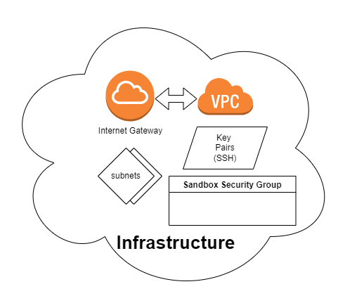
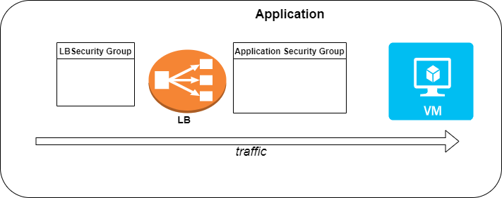

# Create a sandbox using Terraform:
A sandbox is a running functional application that contains all needed resources.
It composed out of a cloud infrastructure and may contain other dependant applications needed to run it.
This repository contains an example how to do it.

## Terraform modules:
1. [Infrstructure](../terraform-modules/sandbox-infra/) - This module generate all needed resources required by any application in the sandbox.\
It generates the following resources:
- A VPC that connected to the internet
- 2 Subnets
- SSH key pairs for any VM running application
- A security group designed to allow a free communication between all relevant resources within the sandbox\

2. [Application](../terraform-modules/sandbox-application/) - This is an abstract module for creating any kind of app.\
It generates the following resources for each app:
- A VM running the app
- Application security group with a specific serving port open for other component of the sandbox
- An optional load balancer designed to pass the public trafic to the application
- A Load balancer security group for external trafic

3. [Java-Spring](../terraform-modules/java-spring/) - This is a concrete application running a web server.\

4. [Guacamole](../terraform-modules/guacamole/) - This is the [Apache Guacamole Project](https://guacamole.apache.org/) application designed to allow a secure access to debug other VMs run by a sandbox.\

## Blueprint
[Java-Spring Blueprint](../blueprints/java-spring.yaml) - This is a blueprint making use of all of the previous Terraform modules.